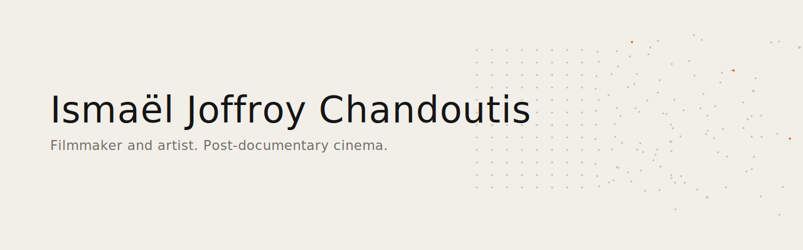
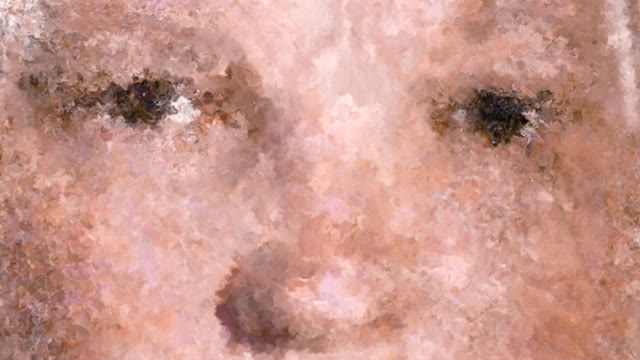
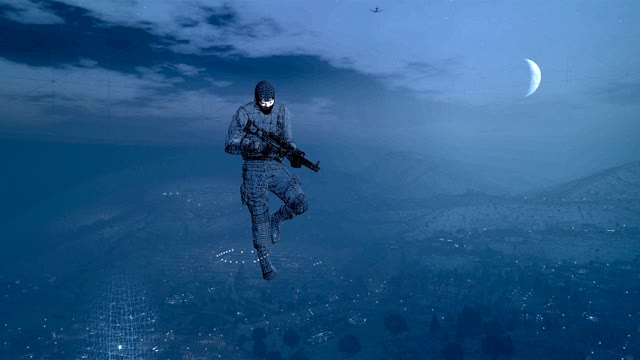
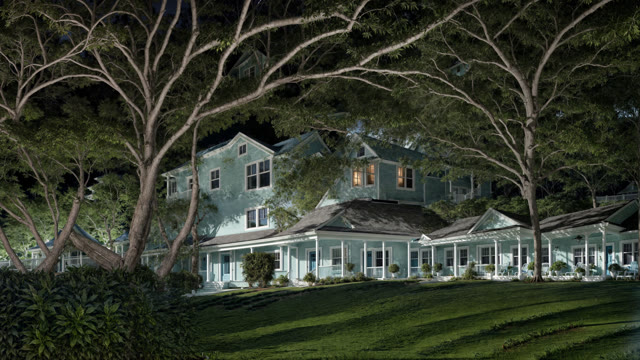
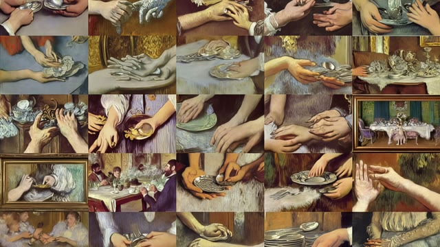
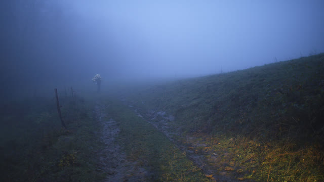

<picture><source media="(prefers-color-scheme: dark)" srcset="banner.svg"></picture>

<i>L'espace latent est devenu mon territoire documentaire.</i>

[English](README.md) · **Français**

# Ismaël Joffroy Chandoutis

**Cinéaste et artiste, Paris. Je construis les instruments computationnels de mes films.**

Je fais des films sur ce qui ne laisse pas d'images : identités en ligne, infrastructures de cybercriminalité, événements numériques advenus sans témoins. L'IA avec laquelle je travaille est une méthode pour imager ce qui ne peut pas être filmé.

**César 2022** du meilleur court métrage documentaire (*Maalbeek*). Semaine de la Critique (Cannes), Annecy, IDFA, Clermont-Ferrand, Hot Docs. Mention honorifique à Ars Electronica. Prix Révélation Art Numérique (ADAGP). Artiste associé au **Centquatre-Paris**. Résident à la **Villa Albertine**. Ancien du **Fresnoy** et de l'**INSAS**.

[ismaeljoffroychandoutis.com](https://ismaeljoffroychandoutis.com)

---

### En ce moment

- ***The Goldberg Variations*** : long métrage hybride sur Joshua Ryne Goldberg, un cas de construction d'identités en ligne. Villa Albertine / Films Grand Huit.
- ***Virus*** : long métrage hybride sur Mihai Ionut Paunescu, qui a opéré un service de bulletproof hosting au cœur de campagnes majeures de malwares (Gozi, Zeus, SpyEye).
- **Spectre** : une seule couche d'intelligence sur toutes mes machines. Une mémoire et un contexte uniques au-dessus de plusieurs stations de travail, avec un CLI agentique comme couche d'exploitation.

---

### Instruments

Les outils que je construis pour ma propre pratique, publiés quand ils se stabilisent.

| | |
|---|---|
| [cinema-ai-toolkit](https://github.com/ismael-joffroy-chandoutis/cinema-ai-toolkit) | Réparation de voix, analyse VHS, OCR d'archives manuscrites. Éprouvés sur de vraies productions |
| [comfyui-cinema-pipeline](https://github.com/ismael-joffroy-chandoutis/comfyui-cinema-pipeline) | ComfyUI pour la production cinéma professionnelle, 70+ workflows avec notes de stabilité honnêtes |
| [comfyui-blender-temporal](https://github.com/ismael-joffroy-chandoutis/comfyui-blender-temporal) | Passes EXR Blender comme conditionnement temporel pour le cinéma IA |
| [oscli](https://github.com/ismael-joffroy-chandoutis/oscli) | Boîte à outils oscilloscope sans interface. Le son est l'image |
| [film-indexer](https://github.com/ismael-joffroy-chandoutis/film-indexer) | Conseil de montage multi-perspectives pour rushes documentaires |
| [agent-viewer](https://github.com/ismael-joffroy-chandoutis/agent-viewer) | Tableau kanban pour orchestrer des flottes d'agents dans tmux |

### Notes de terrain

Comment la pratique fonctionne réellement : configurations, comparatifs, méthodes, documentés de l'intérieur.

- [ai-cinema-method](https://github.com/ismael-joffroy-chandoutis/ai-cinema-method) : l'IA comme méthode artistique
- [agentic-cli-filmmaker](https://github.com/ismael-joffroy-chandoutis/agentic-cli-filmmaker) : l'usage quotidien d'un CLI agentique par un cinéaste
- [open-source-cinema](https://github.com/ismael-joffroy-chandoutis/open-source-cinema) : filmer en RAW avec des caméras débridées et du matériel ouvert
- [stegg-lab](https://github.com/ismael-joffroy-chandoutis/stegg-lab) : stéganographie et provenance des médias pour le documentaire post-deepfake

### Essais (FR/EN)

Écrire depuis l'intérieur d'une pratique native de l'IA. Les versions de référence vivent sur [mon site](https://ismaeljoffroychandoutis.com) ; les dépôts de travail sont ici.

- [posseder-les-mains](https://github.com/ismael-joffroy-chandoutis/posseder-les-mains) : *Posséder les mains, louer le cerveau*, sur les infrastructures souveraines pour la création assistée par IA
- [ne-pas-casser-la-machine](https://github.com/ismael-joffroy-chandoutis/ne-pas-casser-la-machine) : sur l'angoisse de l'IA, ne pas casser la machine, la posséder
- [le-clavier-mal-tempere](https://github.com/ismael-joffroy-chandoutis/le-clavier-mal-tempere) : écrire avec les machines, d'après Bach
- [la-langue-n-existe-pas](https://github.com/ismael-joffroy-chandoutis/la-langue-n-existe-pas) : la langue n'existe pas, et les modèles le prouvent
- [le-bon-format-n-existe-pas](https://github.com/ismael-joffroy-chandoutis/le-bon-format-n-existe-pas) : le bon format n'existe pas non plus
- [souverainete-numerique-critique](https://github.com/ismael-joffroy-chandoutis/souverainete-numerique-critique) : un lexique critique de la souveraineté numérique
- [deep-research](https://github.com/ismael-joffroy-chandoutis/deep-research) : notes de recherche d'un cinéaste travaillant avec des instruments computationnels

### Systèmes agentiques, au-delà du cinéma

Mon studio fonctionne comme un système agentique : une flotte de cinq machines sous une mémoire unique, des équipes d'agents autonomes, des dispositifs de vérification, des chaînes de reporting. Je l'assemble moi-même, et les mêmes systèmes s'appliquent aux organisations. Travaux publics choisis :

- [ai-agentic-methods](https://github.com/ismael-joffroy-chandoutis/ai-agentic-methods) : méthodes agentiques réutilisables : GEO/AEO, reporting, contrôle qualité
- [decentralized-compute-sota](https://github.com/ismael-joffroy-chandoutis/decentralized-compute-sota) : état de l'art vérifié du calcul IA décentralisé
- [autonomie-llm-local-2026](https://github.com/ismael-joffroy-chandoutis/autonomie-llm-local-2026) : matériel LLM local souverain, à partir de la bande passante mémoire

Pour le conseil, les audits et les systèmes IA appliqués : **contact via le [site](https://ismaeljoffroychandoutis.com/contact)**.

---

### Films et art vidéo

Œuvres choisies

<table>
<tr>
<td width="33%"> <i>Maalbeek</i>, 2020</td>
<td width="33%"> <i>Swatted</i>, 2018</td>
<td width="33%"> <i>Madotsuki_the_dreamer</i>, 2023</td>
</tr>
<tr>
<td width="33%"> <i>Virtual Kintsugi</i>, 2023</td>
<td width="33%"> <i>Ondes noires</i>, 2017</td>
<td width="33%"></td>
</tr>
</table>

| | |
|---|---|
| *The Goldberg Variations* | Long métrage hybride, en développement, Villa Albertine 2026 |
| *Virus* | Long métrage hybride, en développement |
| *Rewild* | Installation vidéo, Biennale NÉMO 2025, Centquatre-Paris |
| *Mémoires fractales* | Série photographique et installation vidéo, en cours |
| *Madotsuki_the_dreamer* | Installation vidéo générative, 2023. Videoformes, Biennale NÉMO |
| *Virtual Kintsugi* | Installation vidéo générative, 2023. Collection du Musée Granet |
| *Deep Forensic* | Série photographique, 2022 |
| *Maalbeek* | Court métrage, 2020. César 2022, Semaine de la Critique |
| *Amnesia* | Série d'images numériques, 2019 |
| *Swatted* | Court métrage, 2018. Mention honorifique Ars Electronica, qualifiant aux Oscars |
| *Ondes noires* | Court métrage, 2017. Grand Prix Regensburg |

---

### Travailler avec moi

Commandes et coproductions · direction artistique · œuvres IA d'auteur pour le film, l'installation et l'exposition · systèmes agentiques appliqués pour les organisations · conférences, ateliers et masterclasses.

[ismaeljoffroychandoutis.com](https://ismaeljoffroychandoutis.com) · [Contact](https://ismaeljoffroychandoutis.com/contact) · [Vimeo](https://vimeo.com/user4983240) · [Instagram](https://instagram.com/ismaeljoffroychandoutis) · [IMDb](https://www.imdb.com/name/nm5604010/)
