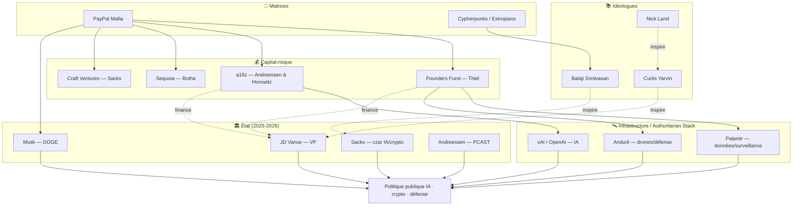
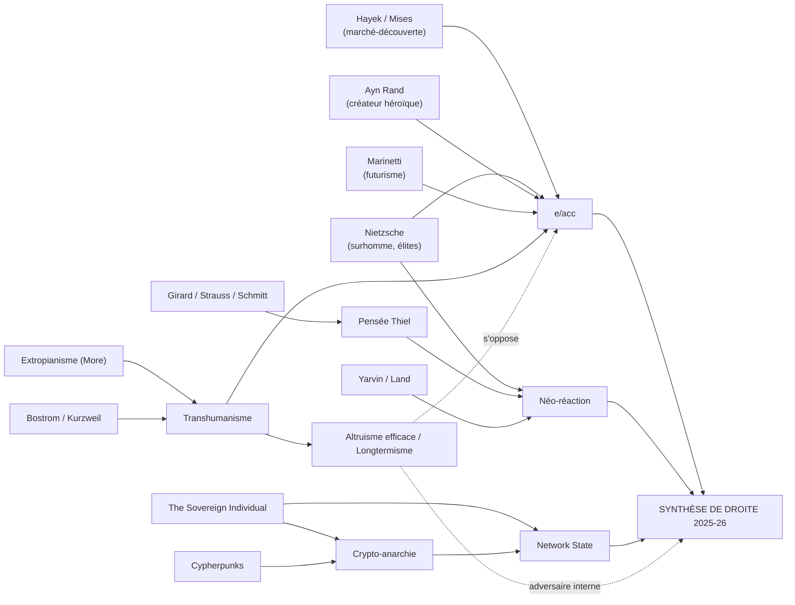

# Cartographie & prospective : qui dirige, où va-t-on ?

> Synthèse transversale des volets 1 à 4. Rédigé le 4 juin 2026.
> Objectif : cartographier les acteurs et idées, puis **anticiper les trajectoires** (qui tient le pouvoir, vers quoi on glisse, quels points de bascule).

---

## Sommaire
1. [Les 4 factions de la tech radicale](#1-les-4-factions-de-la-tech-radicale)
2. [Carte des acteurs (diagramme)](#2-carte-des-acteurs-diagramme)
3. [Carte des idées (diagramme)](#3-carte-des-idées-diagramme)
4. [Qui dirige réellement ? Le « Thielverse » au pouvoir](#4-qui-dirige-réellement--le-thielverse-au-pouvoir)
5. [Les axes structurants](#5-les-axes-structurants)
6. [Prospective : 4 scénarios](#6-prospective--4-scénarios)
7. [Points de bascule à surveiller](#7-points-de-bascule-à-surveiller)
8. [Ce que ça implique](#8-ce-que-ça-implique)

---

## 1. Les 4 factions de la tech radicale

| Faction | Figures | Credo | Rapport à l'État |
|---|---|---|---|
| **Techno-optimistes / e/acc** | Andreessen, Beff Jezos, Sacks, Karp | « Accélérer la techno résout tout » | Dérégulation, puis alliance d'intérêt |
| **Techno-monarchistes / NRx** | Yarvin, Nick Land, (Thiel en sympathie) | « Remplacer la démocratie par l'État-entreprise » | Capture/refondation autoritaire |
| **Souverainistes crypto / exit** | Srinivasan, cypherpunks, Bitcoiners | « Sortir de l'État, network states » | Contournement / sécession |
| **Prudents / longtermistes (EA)** | Bostrom, Yudkowsky, MacAskill | « L'IA est un risque existentiel, ralentir » | Régulation, gouvernance mondiale |

> Les **trois premières** convergent en 2024-2026 (synthèse de droite au pouvoir). La **quatrième** est leur adversaire interne (la « décélération »).

---

## 2. Carte des acteurs (diagramme)

---

## 3. Carte des idées (diagramme)

---

## 4. Qui dirige réellement ? Le « Thielverse » au pouvoir

La donnée centrale de 2025-2026 : **le réseau né de PayPal a pris pied dans l'État**.
- **JD Vance** (vice-président) — protégé de Thiel, fonds Narya financé par Thiel & Andreessen, idées puisées chez Yarvin.
- **Elon Musk** — a dirigé le **DOGE** (coupes dans l'administration).
- **David Sacks** — **« czar » IA & crypto** de la Maison-Blanche.
- **Marc Andreessen** — conseiller, nommé au **PCAST** (2026).
- **Thiel** — aurait placé **≥ 10 proches** dans l'administration.
- **Palantir** — contrat US Army **~10 Md$** (2025).

Ce n'est plus du lobbying : c'est une **fusion partielle entre capital tech et appareil d'État**, ce que des analystes nomment **« Authoritarian Stack »** (cloud + IA + finance + drones + satellites) ou **« oligarchie technologique »** (Oxfam).

> **Réponse directe à « qui dirige » :** une **petite élite réticulaire** (≈ 50-100 personnes) au croisement de quatre fonds (a16z, Founders Fund, Sequoia, Craft), de quelques infrastructures critiques (Palantir, Anduril, xAI/OpenAI) et désormais de postes-clés de l'exécutif américain. **Thiel en est le nœud idéologique ; Andreessen, le porte-voix ; Musk, le bras médiatique/opérationnel ; Vance/Sacks, les relais d'État.**

---

## 5. Les axes structurants

Tout le champ se lit sur **trois axes** :
1. **Accélérer ↔ Sécuriser** (e/acc vs EA) — la faille majeure sur l'IA.
2. **Sortir de l'État ↔ Capturer l'État** (network state/exit vs Thielverse au pouvoir) — tension entre l'éthos cypherpunk anti-État et la réalité 2025 d'une fusion avec l'État.
3. **Égalitaire ↔ Aristocratique** (rhétorique « pro-humain » d'Andreessen vs nietzschéisme assumé de Thiel/Yarvin).

La **trajectoire observée** : déplacement vers **Accélérer + Capturer l'État + Aristocratique**.

---

## 6. Prospective : 4 scénarios

> Scénarios analytiques, non des prédictions. Horizon ~2030.

**A. « Authoritarian Stack » consolidé (techno-oligarchie).**
La fusion capital-tech/État se solidifie : IA + surveillance (Palantir) + finance crypto d'État + défense (Anduril) forment un appareil de pouvoir durable. Démocratie formelle maintenue, contre-pouvoirs affaiblis. *Probabilité : moyenne-haute à court terme.*

**B. Backlash démocratique/régulateur.**
Un accident (IA, krach crypto, scandale de surveillance) ou un cycle électoral inverse provoque un retour de la régulation (UE en tête : AI Act, DMA/DSA), antitrust, fiscalité des milliardaires. La coalition tech-right se fragmente. *Probabilité : moyenne.*

**C. Schisme accel vs sécurité.**
Un incident majeur d'IA réarme le camp « prudent » (EA/Bostrom/Yudkowsky). L'e/acc se fissure ; certains accélérationnistes se rallient à la gouvernance. Recomposition autour de la sécurité de l'IA. *Probabilité : conditionnelle à un choc.*

**D. Fragmentation / « exit » réussi.**
Les network states, zones spéciales (Próspera, charter cities) et juridictions crypto se multiplient : émergence d'enclaves para-souveraines pour ultra-riches, érosion lente de l'État-nation (scénario *Sovereign Individual*). *Probabilité : faible-moyenne, mais cumulative.*

Le plus vraisemblable est un **mélange A + D** (oligarchie au centre, enclaves d'exit en périphérie), **tempéré par B** surtout depuis l'**Europe**.

---

## 7. Points de bascule à surveiller

- **Sécurité de l'IA :** premier accident grave (cyber, bio, désinformation électorale massive) → réarme le camp régulateur (scénario C).
- **Crypto :** un nouveau « FTX » ou, à l'inverse, l'institutionnalisation d'un dollar/stablecoin d'État.
- **Antitrust :** procès contre les hyperscalers / l'IA → test du modèle « monopole assumé » de Thiel.
- **Europe :** application de l'**AI Act**, du **DSA/DMA** → seul contre-pouvoir réglementaire à l'échelle.
- **2026-2028 (cycles électoraux US) :** durabilité ou reflux de la coalition tech-right.
- **Yarvin/NRx :** passage de l'idéologie marginale à des **mesures concrètes** (réforme de la fonction publique, « RAGE »).
- **Open source vs fermeture de l'IA :** ligne de fracture interne (Meta/open vs OpenAI/fermé) aux conséquences géopolitiques.

---

## 8. Ce que ça implique

1. **Le centre de gravité du pouvoir** s'est déplacé du **produit** (logiciel, plateformes) vers l'**infrastructure de l'État** (défense, surveillance, monnaie, IA souveraine).
2. **L'idéologie n'est pas décorative** : elle **précède et justifie** les décisions (Thiel cite Girard ; Andreessen, Marinetti ; Vance, Yarvin). La prendre au sérieux est une condition pour la contester.
3. **Le clivage déterminant des années à venir** n'est pas gauche/droite classique, mais **accélération+concentration du pouvoir** ↔ **prudence+contre-pouvoirs démocratiques**.
4. **L'Europe** apparaît comme le principal **contrepoids institutionnel** ; l'enjeu est de savoir si elle régule sans renoncer à l'innovation.
5. **La meilleure boussole citoyenne** : refuser le faux choix « techno-optimisme béat vs techno-pessimisme ». La position défendable est l'**innovation couplée à la démocratie, au pluralisme, à l'éthique et à l'écologie** — exactement ce que les manifestes étudiés évacuent.

---

### Voir aussi
- [Manifeste Techno-Optimiste (Andreessen)](./manifeste-techno-optimiste-andreessen.md)
- [Peter Thiel & la PayPal Mafia](./peter-thiel-paypal-mafia.md)
- [Généalogie philosophique, littéraire & SF](./genealogie-philosophique-litteraire-sf.md)
- [Transhumanisme × Crypto](./transhumanisme-crypto-convergences.md)
- [Cartographie interactive (HTML)](./cartographie.html)
