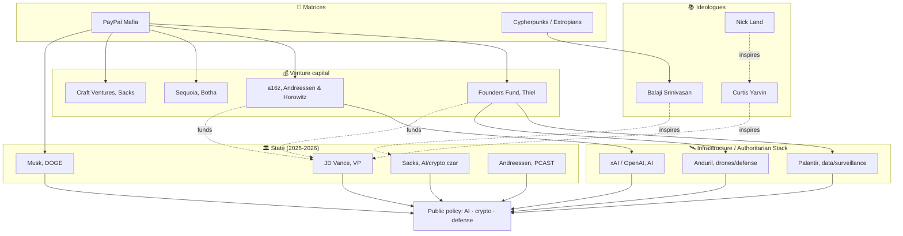
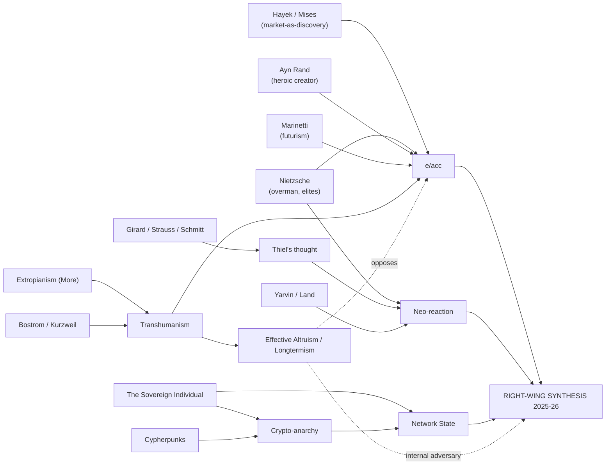

# Mapping & foresight: who is in charge, where are we headed?

> Cross-cutting synthesis of parts 1 to 4. Written on June 4, 2026.
> Objective: map the actors and ideas, then **anticipate the trajectories** (who holds power, what we are drifting toward, which tipping points matter).

---

## Contents
1. [The 4 factions of radical tech](#1-the-4-factions-of-radical-tech)
2. [Map of the actors (diagram)](#2-map-of-the-actors-diagram)
3. [Map of the ideas (diagram)](#3-map-of-the-ideas-diagram)
4. [Who really rules? The "Thielverse" in power](#4-who-really-rules-the-thielverse-in-power)
5. [The structuring axes](#5-the-structuring-axes)
6. [Foresight: 4 scenarios](#6-foresight-4-scenarios)
7. [Tipping points to watch](#7-tipping-points-to-watch)
8. [What it implies](#8-what-it-implies)

---

## 1. The 4 factions of radical tech

| Faction | Figures | Creed | Relationship to the State |
|---|---|---|---|
| **Techno-optimists / e/acc** | Andreessen, Beff Jezos, Sacks, Karp | "Accelerating technology solves everything" | Deregulation, then alliance of interest |
| **Techno-monarchists / NRx** | Yarvin, Nick Land, (Thiel in sympathy) | "Replace democracy with the corporate-State" | Authoritarian capture/refounding |
| **Crypto sovereigntists / exit** | Srinivasan, cypherpunks, Bitcoiners | "Exit the State, network states" | Circumvention / secession |
| **Cautious / longtermists (EA)** | Bostrom, Yudkowsky, MacAskill | "AI is an existential risk, slow down" | Regulation, global governance |

> The **first three** converge in 2024-2026 (a right-wing synthesis in power). The **fourth** is their internal adversary (the "deceleration").

---

## 2. Map of the actors (diagram)

---

## 3. Map of the ideas (diagram)

---

## 4. Who really rules? The "Thielverse" in power

The central fact of 2025-2026: **the network born out of PayPal has gained a foothold in the State.**
- **JD Vance** (vice president), Thiel protégé, Narya fund backed by Thiel & Andreessen, ideas drawn from Yarvin.
- **Elon Musk**, led **DOGE** (cuts to the federal administration).
- **David Sacks**, White House **AI & crypto "czar"**.
- **Marc Andreessen**, advisor, appointed to **PCAST** (2026).
- **Thiel**, reportedly placed **≥ 10 associates** in the administration.
- **Palantir**, US Army contract of **~$10B** (2025).

This is no longer lobbying: it is a **partial fusion between tech capital and the State apparatus**, what some analysts call the **"Authoritarian Stack"** (cloud + AI + finance + drones + satellites) or a **"technological oligarchy"** (Oxfam).

> **Direct answer to "who rules":** a **small reticular elite** (≈ 50-100 people) at the intersection of four funds (a16z, Founders Fund, Sequoia, Craft), a handful of critical infrastructures (Palantir, Anduril, xAI/OpenAI), and now key posts in the US executive branch. **Thiel is its ideological hub; Andreessen, the spokesperson; Musk, the media/operational arm; Vance/Sacks, the State relays.**

---

## 5. The structuring axes

The entire field can be read along **three axes**:
1. **Accelerate ↔ Secure** (e/acc vs EA), the major fault line on AI.
2. **Exit the State ↔ Capture the State** (network state/exit vs Thielverse in power), the tension between the anti-State cypherpunk ethos and the 2025 reality of a fusion with the State.
3. **Egalitarian ↔ Aristocratic** (Andreessen's "pro-human" rhetoric vs the avowed Nietzscheanism of Thiel/Yarvin).

The **observed trajectory**: a shift toward **Accelerate + Capture the State + Aristocratic**.

---

## 6. Foresight: 4 scenarios

> Analytical scenarios, not predictions. Horizon ~2030.

**A. Consolidated "Authoritarian Stack" (techno-oligarchy).**
The tech-capital/State fusion solidifies: AI + surveillance (Palantir) + State crypto finance + defense (Anduril) form a durable apparatus of power. Formal democracy maintained, checks and balances weakened. *Probability: medium-high in the short term.*

**B. Democratic/regulatory backlash.**
An accident (AI, crypto crash, surveillance scandal) or a reversed electoral cycle triggers a return of regulation (the EU leading: AI Act, DMA/DSA), antitrust, taxation of billionaires. The tech-right coalition fragments. *Probability: medium.*

**C. Accel vs safety schism.**
A major AI incident rearms the "cautious" camp (EA/Bostrom/Yudkowsky). e/acc cracks; some accelerationists rally to governance. Recomposition around AI safety. *Probability: conditional on a shock.*

**D. Fragmentation / successful "exit".**
Network states, special zones (Próspera, charter cities), and crypto jurisdictions multiply: emergence of para-sovereign enclaves for the ultra-wealthy, slow erosion of the nation-state (the *Sovereign Individual* scenario). *Probability: low-medium, but cumulative.*

The most likely is a **mix of A + D** (oligarchy at the center, exit enclaves on the periphery), **tempered by B** above all from **Europe**.

---

## 7. Tipping points to watch

- **AI safety:** the first serious accident (cyber, bio, massive electoral disinformation) → rearms the regulatory camp (scenario C).
- **Crypto:** a new "FTX" or, conversely, the institutionalization of a State dollar/stablecoin.
- **Antitrust:** lawsuits against the hyperscalers / AI → a test of Thiel's "embraced monopoly" model.
- **Europe:** enforcement of the **AI Act**, the **DSA/DMA** → the only regulatory counterweight at scale.
- **2026-2028 (US electoral cycles):** the durability or retreat of the tech-right coalition.
- **Yarvin/NRx:** the shift from marginal ideology to **concrete measures** (civil service reform, "RAGE").
- **Open source vs closed AI:** an internal fault line (Meta/open vs OpenAI/closed) with geopolitical consequences.

---

## 8. What it implies

1. **The center of gravity of power** has shifted from the **product** (software, platforms) to the **infrastructure of the State** (defense, surveillance, money, sovereign AI).
2. **Ideology is not decorative**: it **precedes and justifies** decisions (Thiel cites Girard; Andreessen, Marinetti; Vance, Yarvin). Taking it seriously is a precondition for contesting it.
3. **The decisive cleavage of the coming years** is not the classic left/right, but **acceleration+concentration of power** ↔ **caution+democratic checks and balances**.
4. **Europe** appears as the main **institutional counterweight**; the question is whether it can regulate without giving up on innovation.
5. **The best civic compass**: refuse the false choice of "blissful techno-optimism vs techno-pessimism". The defensible position is **innovation coupled with democracy, pluralism, ethics, and ecology**, exactly what the manifestos studied here cast aside.

---

### See also
- [Techno-Optimist Manifesto (Andreessen)](./manifeste-techno-optimiste-andreessen.md)
- [Peter Thiel & the PayPal Mafia](./peter-thiel-paypal-mafia.md)
- [Philosophical, literary & SF genealogy](./genealogie-philosophique-litteraire-sf.md)
- [Transhumanism × Crypto](./transhumanisme-crypto-convergences.md)
- [Interactive map (HTML)](./cartographie.html)
