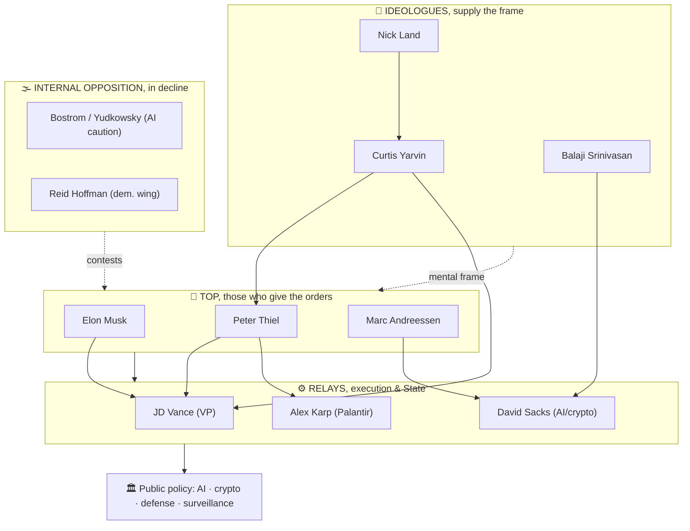

# Hierarchy of power & influence (as of 2026)

> Analytical ranking. Written on June 4, 2026.
> "Who carries the most weight *today*?", a combination of 4 levers: **capital** (money/funds), **infrastructure** (real technological control), **State** (access/posts in power), **ideology** (the capacity to impose the mental frame).

> ⚠️ Qualitative estimate based on the sources of parts 1-7 (scores out of 10, subjective but argued). This is not an exact measurement.

---

## 1. Hierarchy table (overall score)

| Rank | Person | Capital | Infra | State | Ideo | **Total /40** | Role |
|---|---|:--:|:--:|:--:|:--:|:--:|---|
| 🥇 1 | **Elon Musk** | 10 | 10 | 9 | 8 | **37** | Operational & media arm; Tesla/SpaceX/xAI/X, ex-DOGE |
| 🥈 2 | **Peter Thiel** | 9 | 8 | 9 | 10 | **36** | Ideological & network hub; Palantir, Founders Fund, "kingmaker" |
| 🥉 3 | **Marc Andreessen** | 9 | 7 | 7 | 9 | **32** | Spokesperson for e/acc; a16z, PCAST |
| 4 | **JD Vance** | 3 | 2 | 10 | 6 | **21** | State relay no. 1 (vice president) |
| 5 | **David Sacks** | 6 | 4 | 8 | 5 | **23** | White House AI & crypto "czar" |
| 6 | **Alex Karp** | 6 | 9 | 6 | 4 | **25** | CEO of Palantir (core of the "Authoritarian Stack") |
| 7 | **Sam Altman** | 6 | 9 | 5 | 6 | **26** | OpenAI, control of frontier AI (outside Thiel's orbit) |
| 8 | **Curtis Yarvin** | 1 | 0 | 4 | 9 | **14** | Court ideologue (NRx) |
| 9 | **Balaji Srinivasan** | 6 | 3 | 2 | 7 | **18** | Crypto / network state theorist |
| 10 | **Reid Hoffman** | 8 | 5 | 3 | 4 | **20** | Democratic counter-pole of the PayPal network |
| 11 | **Nick Land** | 0 | 0 | 1 | 8 | **9** | Theoretical source (accelerationism/NRx) |
| 12 | **Bostrom / Yudkowsky** | 2 | 1 | 2 | 7 | **12** | "AI caution" camp (influence in decline) |
|, | **Marinetti** (1876-1944) |, |, |, | hist. |, | Historical reference (futurism/fascism) |

> Reading: the **Musk-Thiel-Andreessen trio** clearly dominates. Vance/Sacks/Karp are powerful but more specialized **relays/executors**. Yarvin/Land carry weight **through ideology alone** (capital/infra score ≈ 0), but that ideology now permeates the top of the State.

---

## 2. Diagram: the pyramid of power

---

## 3. Hierarchy by type of power

**💰 Capital (who has/directs the money)**
1. Musk · 2. Andreessen (a16z) ≈ Thiel (Founders Fund) · 3. Hoffman · 4. Botha (Sequoia, off-list)

**🛰️ Infrastructure (who controls the real technology)**
1. Musk (SpaceX/xAI/X) ≈ Altman (OpenAI) · 2. Karp (Palantir) · 3. a16z (portfolio)

**🏛️ Access to the State (2025-26)**
1. Vance (VP) · 2. Musk (ex-DOGE) · 3. Thiel (≥10 associates placed) · 4. Sacks · 5. Andreessen (PCAST)

**🧠 Ideology (who imposes the mental frame)**
1. Thiel · 2. Andreessen (manifesto) · 3. Yarvin · 4. Land · 5. Balaji

---

## 4. Reading in one sentence

> **Thiel thinks, Andreessen preaches, Musk executes**, and **Vance, Sacks, Karp** turn it all into **State policy**, on an ideological foundation supplied by **Yarvin and Land**. The main uncertainty remains AI: **Altman/OpenAI** (outside Thiel's orbit) and the **caution camp** (Bostrom/Yudkowsky) are the variables that could reshuffle the deck.

---

### See also
[Mapping & foresight](./cartographie-prospective.md) · [Interactive map HTML](./cartographie.html) · [Thiel](./peter-thiel-paypal-mafia.md) · [Andreessen](./manifeste-techno-optimiste-andreessen.md)
