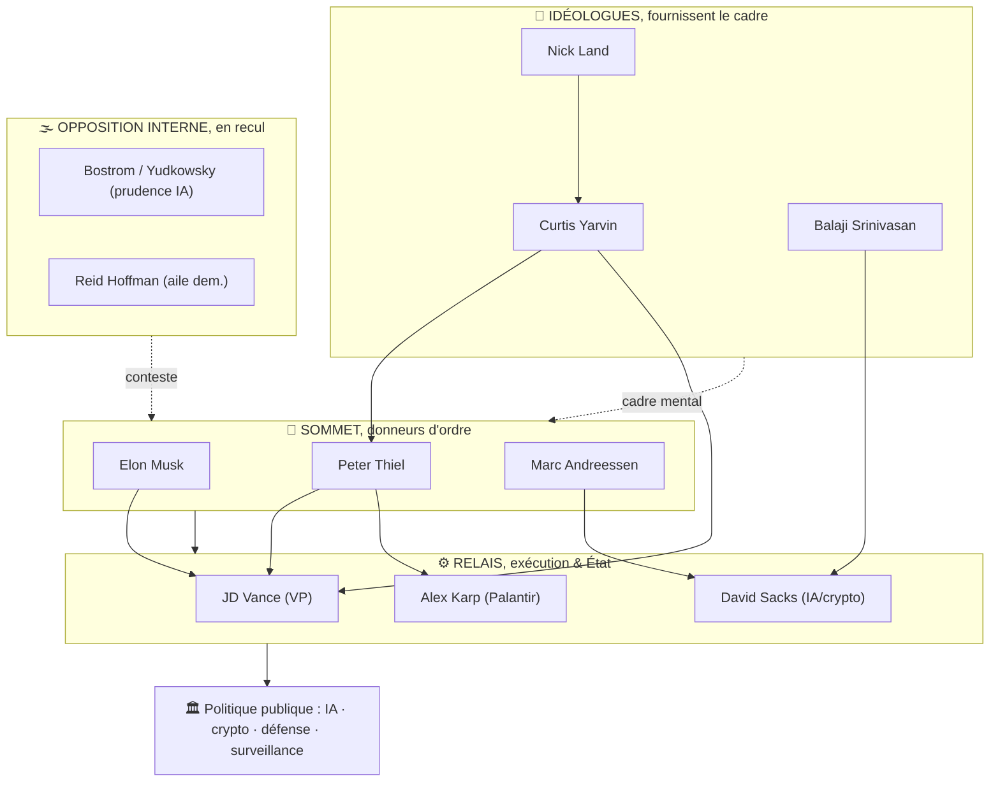

# Hiérarchie du pouvoir & de l'influence (état 2026)

> Classement analytique. Rédigé le 4 juin 2026.
> « Qui pèse le plus *aujourd'hui* ? », combinaison de 4 leviers : **capital** (argent/fonds), **infrastructure** (contrôle techno réel), **État** (accès/postes au pouvoir), **idéologie** (capacité à imposer le cadre mental).

> ⚠️ Estimation qualitative à partir des sources des volets 1-7 (notes /10, subjectives mais argumentées). Ce n'est pas une mesure exacte.

---

## 1. Tableau de hiérarchie (score global)

| Rang | Personne | Capital | Infra | État | Idéo | **Total /40** | Rôle |
|---|---|:--:|:--:|:--:|:--:|:--:|---|
| 🥇 1 | **Elon Musk** | 10 | 10 | 9 | 8 | **37** | Bras opérationnel & médiatique ; Tesla/SpaceX/xAI/X, ex-DOGE |
| 🥈 2 | **Peter Thiel** | 9 | 8 | 9 | 10 | **36** | Nœud idéologique & réseau ; Palantir, Founders Fund, « kingmaker » |
| 🥉 3 | **Marc Andreessen** | 9 | 7 | 7 | 9 | **32** | Porte-voix de l'e/acc ; a16z, PCAST |
| 4 | **JD Vance** | 3 | 2 | 10 | 6 | **21** | Relais d'État n°1 (vice-président) |
| 5 | **David Sacks** | 6 | 4 | 8 | 5 | **23** | « Czar » IA & crypto de la Maison-Blanche |
| 6 | **Alex Karp** | 6 | 9 | 6 | 4 | **25** | PDG Palantir (cœur de l'« Authoritarian Stack ») |
| 7 | **Sam Altman** | 6 | 9 | 5 | 6 | **26** | OpenAI, contrôle de l'IA de pointe (hors orbite Thiel) |
| 8 | **Curtis Yarvin** | 1 | 0 | 4 | 9 | **14** | Idéologue de cour (NRx) |
| 9 | **Balaji Srinivasan** | 6 | 3 | 2 | 7 | **18** | Théoricien crypto / network state |
| 10 | **Reid Hoffman** | 8 | 5 | 3 | 4 | **20** | Contre-pôle démocrate du réseau PayPal |
| 11 | **Nick Land** | 0 | 0 | 1 | 8 | **9** | Source théorique (accélérationnisme/NRx) |
| 12 | **Bostrom / Yudkowsky** | 2 | 1 | 2 | 7 | **12** | Camp « prudence IA » (influence en recul) |
|, | **Marinetti** (1876-1944) |, |, |, | hist. |, | Référence historique (futurisme/fascisme) |

> Lecture : le **trio Musk-Thiel-Andreessen** domine nettement. Vance/Sacks/Karp sont des **relais/exécutants** puissants mais plus spécialisés. Yarvin/Land pèsent **uniquement par l'idéologie** (note capital/infra ≈ 0), mais cette idéologie irrigue désormais le sommet de l'État.

---

## 2. Schéma : la pyramide du pouvoir

---

## 3. Hiérarchie par type de pouvoir

**💰 Capital (qui a/dirige l'argent)**
1. Musk · 2. Andreessen (a16z) ≈ Thiel (Founders Fund) · 3. Hoffman · 4. Botha (Sequoia, hors liste)

**🛰️ Infrastructure (qui contrôle la techno réelle)**
1. Musk (SpaceX/xAI/X) ≈ Altman (OpenAI) · 2. Karp (Palantir) · 3. a16z (portefeuille)

**🏛️ Accès à l'État (2025-26)**
1. Vance (VP) · 2. Musk (ex-DOGE) · 3. Thiel (≥10 proches placés) · 4. Sacks · 5. Andreessen (PCAST)

**🧠 Idéologie (qui impose le cadre mental)**
1. Thiel · 2. Andreessen (manifeste) · 3. Yarvin · 4. Land · 5. Balaji

---

## 4. Lecture en une phrase

> **Thiel pense, Andreessen prêche, Musk exécute**, et **Vance, Sacks, Karp** transforment tout cela en **politique d'État**, sur un soubassement idéologique fourni par **Yarvin et Land**. La principale incertitude reste l'IA : **Altman/OpenAI** (hors orbite Thiel) et le **camp de la prudence** (Bostrom/Yudkowsky) sont les variables qui peuvent rebattre les cartes.

---

### Voir aussi
[Cartographie & prospective](./cartographie-prospective.md) · [Carte interactive HTML](./cartographie.html) · [Thiel](./peter-thiel-paypal-mafia.md) · [Andreessen](./manifeste-techno-optimiste-andreessen.md)
